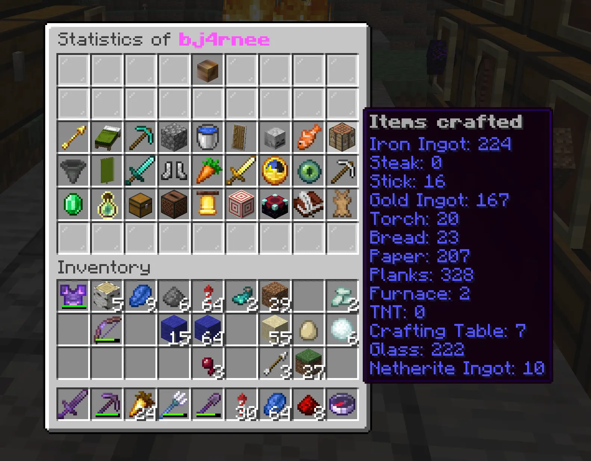

# StatisticsUI

A Paper/Spigot plugin that shows a player's Minecraft statistics in a GUI.

<p align="center">
  
</p>

```
/stats            view your own statistics
/stats <player>   view another player's statistics
/stats reload     reload the configuration
```

## Requirements

- Java 21
- Paper or Spigot, Minecraft 1.20.6 to 26.x

## Permissions

Permission checks are off by default. Set `permissions.enabled: true` in `config.yml` to enforce:

| Permission            | Default | Purpose                              |
|-----------------------|---------|--------------------------------------|
| `statsui.view`        | true    | View your own statistics             |
| `statsui.view.others` | true    | View other players' statistics       |
| `statsui.reload`      | op      | Reload the configuration             |

## Configuration

```yaml
permissions:
  enabled: false     # when true, the statsui.* permissions are enforced
cache:
  seconds: 300        # how long rendered statistics stay cached. 0 disables caching
```

## Building

The Gradle wrapper is included, so no local Gradle install is needed.

```
./gradlew build   # output: build/libs/StatisticsUI-<version>.jar
```

Drop the built jar into your server's `plugins/` folder and restart.

## Stat ideas (not yet added)

- [ ] Items broken (`BREAK_ITEM`, per item, e.g. Elytra / tools)
- [ ] Block Interactions: Smithing Table, Stonecutter, Loom, Cartography Table (`INTERACT_WITH_*`)
- [ ] Movements: Walked underwater (`WALK_UNDER_WATER_ONE_CM`), Sneak time (`SNEAK_TIME`)
- [ ] Tools: Brush, Mace, Spyglass (`USE_ITEM`)
- [ ] Item Interactions: Wind Charge, Ominous Bottle, Chorus Fruit (`USE_ITEM`)
- [x] Deaths: killed-by breakdown (`ENTITY_KILLED_BY`)
